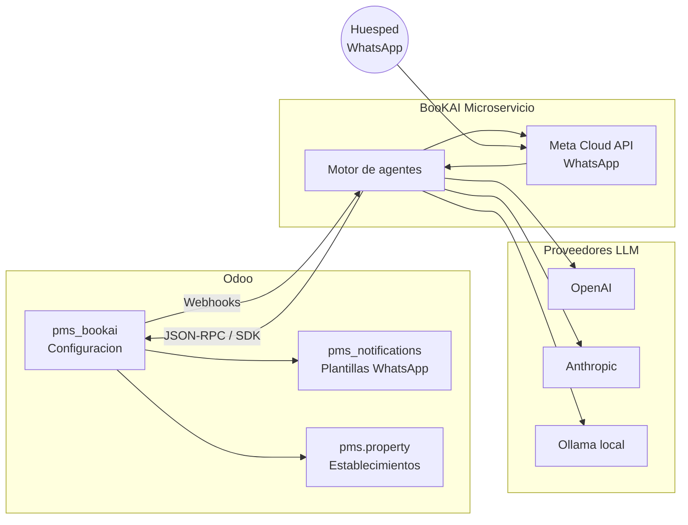
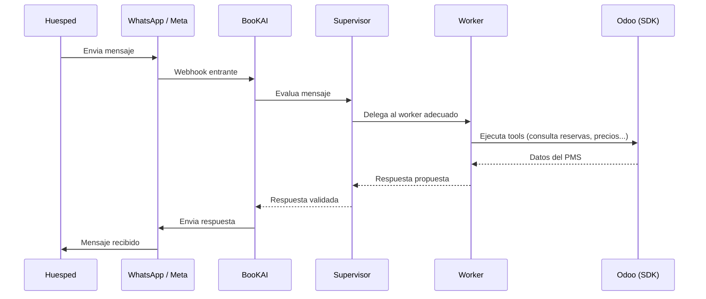
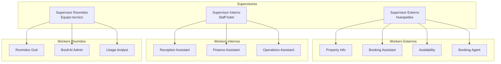
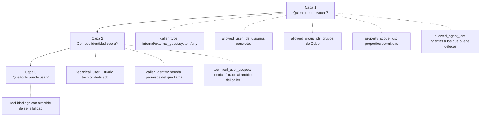

# BooKAI — Guia de configuracion y uso

**Modulo pms_bookai para Odoo 16** Version 16.0.3.0.0 — Abril 2026

---

## 1. Introduccion

### 1.1 Que es BooKAI

BooKAI es un sistema de agentes conversacionales de IA para el sector hotelero. Permite
a los establecimientos ofrecer atencion automatizada a huespedes via WhatsApp, asistir
al personal del hotel y automatizar tareas operativas.

El modulo **pms_bookai** es el panel de control dentro de Odoo: desde el se configuran
los agentes, sus herramientas, bases de conocimiento, plantillas WhatsApp y la conexion
con el microservicio BooKAI.

### 1.2 Arquitectura general



**Flujo resumido:**

- Odoo es la **fuente de verdad**: agentes, tools, KB, properties y plantillas se
  configuran aqui.
- Cada cambio en Odoo se notifica automaticamente al microservicio BooKAI via webhooks.
- BooKAI ejecuta las conversaciones, invocando agentes y tools, y se comunica con Odoo
  via JSON-RPC para consultar/modificar datos del PMS.

### 1.3 Flujo de una conversacion



---

## 2. Configuracion inicial

### 2.1 Ajustes generales

**Ruta:** Ajustes > General > seccion BooKAI

> `[SCREENSHOT: Pagina de ajustes de BooKAI en Settings]`

| Campo               | Descripcion                                                   |
| ------------------- | ------------------------------------------------------------- |
| **BooKAI Base URL** | URL del servicio BooKAI (ej: `https://bookai.tudominio.com`)  |
| **Odoo Username**   | Usuario de Odoo que BooKAI usara para conectarse via JSON-RPC |
| **Odoo API Key**    | API Key del usuario (Preferencias > Claves API)               |
| **Bearer Token**    | Token auto-generado tras el registro. No editar manualmente   |

### 2.2 Registro de instancia

1. Configura la URL base y las credenciales Odoo
2. Pulsa **"Register Instance"**
3. Introduce la **provisioning key** (clave de un solo uso proporcionada por el equipo
   BooKAI)
4. El sistema genera automaticamente el Bearer Token
5. Pulsa **"Re-sync with BooKAI"** para sincronizar la configuracion

> `[SCREENSHOT: Wizard de registro con campo provisioning key]`

### 2.3 Cuentas LLM

**Ruta:** BooKAI > LLM Accounts

Cada cuenta LLM representa una conexion a un proveedor de IA.

> `[SCREENSHOT: Listado de cuentas LLM]`

| Campo                     | Descripcion                                                        |
| ------------------------- | ------------------------------------------------------------------ |
| **Proveedor**             | OpenAI, Anthropic, Ollama, LiteLLM, Custom                         |
| **API Key**               | Clave de acceso al proveedor                                       |
| **API Base URL**          | Solo si el proveedor es custom o Ollama (URL local)                |
| **Modelo por defecto**    | Modelo que usaran los agentes si no especifican otro (ej: `gpt-4`) |
| **Limite mensual tokens** | 0 = sin limite. Permite controlar el gasto                         |
| **Tokens usados (mes)**   | Indicador automatico del consumo actual                            |

**Importante:** Si un agente maneja datos sensibles (DNI, tarjetas), usa un proveedor
**Ollama** (local) para que los datos no salgan de vuestros servidores.

---

## 3. Configurar un establecimiento

**Ruta:** PMS > Properties > [Propiedad] > Pestana BooKAI

> `[SCREENSHOT: Pestana BooKAI en formulario de property]`

### 3.1 Modo BooKAI

| Modo         | Comportamiento                                                                                              |
| ------------ | ----------------------------------------------------------------------------------------------------------- |
| **Disabled** | BooKAI desactivado para este hotel. No se envian WhatsApps ni se procesan conversaciones                    |
| **Manual**   | Solo se pueden enviar WhatsApps de forma manual (boton en folio). Las reglas automaticas estan desactivadas |
| **AI**       | Modo completo: reglas automaticas + conversaciones IA activas                                               |

### 3.2 Venta online

- **BooKAI Online Selling**: Activa la venta de reservas a traves de BooKAI
- **Sale Channel**: Canal de venta PMS que se asignara a las reservas creadas por
  BooKAI. Obligatorio si la venta online esta activa

### 3.3 Canal WhatsApp

Credenciales de Meta Cloud API para este establecimiento:

| Campo                  | Descripcion                                 |
| ---------------------- | ------------------------------------------- |
| **WA Phone Number ID** | ID del numero de telefono en Meta           |
| **WA Access Token**    | Token Bearer de Meta para enviar mensajes   |
| **WA Account ID**      | ID de la cuenta de WhatsApp Business        |
| **WA Verify Token**    | Token para verificacion de webhooks de Meta |
| **WA Display Number**  | Numero visible (ej: "+34 900 123 456")      |

### 3.4 Escalacion

Cuando BooKAI no puede resolver una conversacion, escala a personal humano:

| Campo                       | Descripcion                                                                               |
| --------------------------- | ----------------------------------------------------------------------------------------- |
| **Contactos de escalacion** | Usuarios que recibiran la alerta WhatsApp. Solo los que tengan telefono movil configurado |
| **Timeout (min)**           | Minutos sin respuesta antes de enviar la alerta. 0 = desactivado                          |
| **Template de escalacion**  | Plantilla WhatsApp para la alerta de escalacion                                           |

### 3.5 App URL

URL de la aplicacion del hotel para este property. Si se deja vacio, se usa la URL
global configurada en parametros del sistema.

---

## 4. Agentes

**Ruta:** BooKAI > Agents

### 4.1 Conceptos



- **Supervisores**: Reciben los mensajes, deciden que worker usar, validan respuestas y
  escalan si es necesario. Son protegidos: no se pueden borrar ni modificar su nombre
  tecnico.
- **Workers**: Ejecutan tareas especificas usando tools. Cada worker tiene un ambito
  concreto (informacion de hotel, reservas, finanzas...).

### 4.2 Vista kanban

La vista principal de agentes muestra tarjetas con:

> `[SCREENSHOT: Vista kanban de agentes]`

- **Imagen** del agente
- **Nombre** y nombre tecnico
- **Contadores**: numero de tools, agentes delegados y documentos KB
- **Badges**: "GOD MODE" (naranja), "Supervisor" (escudo), "Archived" (rojo)
- **Rol de ejecucion** y **politica de confirmacion**
- **Modo de identidad** y usuario tecnico asignado

### 4.3 Crear un agente

> `[SCREENSHOT: Formulario de agente - pestana general]`

**Campos de identidad:**

| Campo              | Descripcion                                                  | Ejemplo                 |
| ------------------ | ------------------------------------------------------------ | ----------------------- |
| **Nombre**         | Nombre visible del agente                                    | "Asistente de reservas" |
| **Nombre tecnico** | Identificador unico. Solo minusculas, numeros y guiones      | `booking-assistant`     |
| **Caller Type**    | Quien puede invocarlo: Internal, External Guest, System, Any | `external_guest`        |

**Configuracion LLM:**

| Campo               | Descripcion                                              |
| ------------------- | -------------------------------------------------------- |
| **Cuenta LLM**      | Proveedor de IA a usar                                   |
| **Modelo LLM**      | Modelo especifico (deja vacio para usar el de la cuenta) |
| **Temperatura**     | 0.0 = determinista, 1.0 = creativo. Recomendado: 0.2-0.5 |
| **Max Tokens**      | Limite de longitud de respuesta                          |
| **Datos sensibles** | Si es True, se recomienda usar Ollama (local)            |

**Prompts:**

| Campo                | Descripcion                                                                    |
| -------------------- | ------------------------------------------------------------------------------ |
| **System Prompt**    | Instrucciones base del agente. Define su personalidad, reglas y comportamiento |
| **Context Template** | Plantilla para inyectar contexto de KB. Usa `{kb_context}` como placeholder    |

### 4.4 Capas de permisos



**Capa 1 — Quien puede invocar:**

- **Caller Type**: Define el tipo de usuario que puede usar este agente
- **Usuarios/Grupos/Properties**: Restricciones adicionales opcionales (vacio = sin
  restriccion)
- **Agentes delegados**: Otros agentes a los que este puede delegar trabajo

**Capa 2 — Con que identidad opera:**

- **Technical User**: Usa un usuario de Odoo dedicado (recomendado para la mayoria)
- **Caller Identity**: Hereda los permisos del usuario que lo invoca (solo para agentes
  internos)
- **Technical User Scoped**: Usa usuario tecnico pero filtrado al ambito del caller

**God Mode**: Acceso completo a Odoo. Todas las escrituras requieren confirmacion y se
registran en el Audit Log. Solo para administradores.

### 4.5 Modos de ejecucion

| Campo                        | Opciones                                  | Descripcion                                                                             |
| ---------------------------- | ----------------------------------------- | --------------------------------------------------------------------------------------- |
| **Rol de ejecucion**         | Advisor / Assistant / Operator            | Advisor solo propone, Assistant ejecuta con confirmacion, Operator ejecuta directamente |
| **Politica de confirmacion** | Always / Sensitive / Irreversible / Never | Cuando pedir confirmacion al usuario antes de ejecutar una accion                       |
| **Nivel de log**             | Basic / Full / Debug                      | Cuanto detalle se registra en las ejecuciones                                           |

**Combinacion recomendada para agentes de huespedes:** Assistant + Sensitive + Basic

---

## 5. Tools y MCP

### 5.1 Catalogo de tools

**Ruta:** BooKAI > Tools

Las tools son las acciones que los agentes pueden ejecutar: consultar reservas,
comprobar disponibilidad, crear reservas, etc.

> `[SCREENSHOT: Listado de tools con filtro por tipo]`

**Tipos de tools:**

| Tipo            | Descripcion                                      | Ejemplo                   |
| --------------- | ------------------------------------------------ | ------------------------- |
| **SDK**         | Metodo del SDK de Roomdoo ejecutado via JSON-RPC | `reservations.get`        |
| **MCP**         | Tool descubierta de un servidor MCP              | `brave_search`            |
| **Webhook**     | Llamada HTTP a un servicio externo               | Notificacion a Slack      |
| **HTTP**        | Peticion HTTP generica                           | API externa               |
| **Odoo Action** | Metodo de un modelo de Odoo                      | `pms.reservation.confirm` |
| **Function**    | Funcion interna de BooKAI                        | Calculo personalizado     |

**Sensibilidad de acciones:**

| Nivel            | Descripcion                                        | Ejemplo                             |
| ---------------- | -------------------------------------------------- | ----------------------------------- |
| **None**         | No requiere confirmacion                           | Consultar informacion               |
| **Sensitive**    | Requiere confirmacion segun la politica del agente | Modificar reserva                   |
| **Irreversible** | Siempre requiere confirmacion                      | Cancelar reserva, eliminar registro |

### 5.2 Bindings (asignar tools a agentes)

Desde el formulario del agente, pestana **Tools**, se asignan tools con posibilidad de:

- **Override de descripcion**: Personalizar como se describe la tool para este agente
- **Override de sensibilidad**: Cambiar el nivel de sensibilidad para este agente
  concreto

### 5.3 Servidores MCP

**Ruta:** BooKAI > MCP Servers

Los servidores MCP (Model Context Protocol) permiten extender las capacidades de los
agentes con herramientas externas (busqueda web, acceso a APIs, etc.).

> `[SCREENSHOT: Formulario de servidor MCP con botones de accion]`

**Flujo de trabajo:**

1. **Crear servidor**: Elegir transporte (stdio para local, HTTP para remoto)
2. **Connect**: Establece la conexion con el servidor
3. **Discover Tools**: Descubre automaticamente las tools disponibles y las crea en el
   catalogo
4. **Check Status**: Verifica que el servidor sigue activo

**Transporte stdio** (local): Se ejecuta un proceso en el servidor BooKAI

- Command: `npx`, `uvx`, `python`...
- Args: nombre del paquete MCP
- Env vars: Variables de entorno en JSON (ej: `{"BRAVE_API_KEY": "xxx"}`)

**Transporte HTTP** (remoto): Se conecta a un servidor MCP via HTTP

- URL del servidor
- Tipo de autenticacion: Bearer token o ninguna
- API Key

**Health check automatico:** Un cron cada 5 minutos verifica el estado de todos los
servidores MCP activos y reconecta los que se hayan desconectado.

---

## 6. Knowledge Base

**Ruta:** BooKAI > KB Documents

Los documentos de KB proporcionan informacion contextual a los agentes. Cuando un agente
necesita responder, consulta los documentos que tiene asignados.

> `[SCREENSHOT: Listado de documentos KB]`

### 6.1 Tipos de documentos

| Tipo         | Uso                                    | Inyeccion                            |
| ------------ | -------------------------------------- | ------------------------------------ |
| **Markdown** | Contenido editado directamente en Odoo | Se inyecta siempre en el prompt      |
| **PDF**      | Archivo adjunto                        | Se vectoriza para busqueda semantica |
| **URL**      | Pagina web                             | Se vectoriza para busqueda semantica |

### 6.2 Comportamiento

| Campo             | Descripcion                                                                                              |
| ----------------- | -------------------------------------------------------------------------------------------------------- |
| **Inject Always** | El contenido completo se incluye en cada prompt del agente. Ideal para instrucciones cortas y criticas   |
| **Vectorize**     | El contenido se indexa para busqueda semantica. BooKAI busca los fragmentos relevantes segun la pregunta |
| **Vector Status** | Estado del procesamiento: Not Needed, Pending, Ready, Error                                              |

**Tipos de documento** (clasificacion organizativa): Instruction, Skill, FAQ, Manual,
Context

### 6.3 Asignar a agentes

En el formulario del documento, pestana **Agents**, selecciona los agentes que tendran
acceso a este documento. Un documento puede estar asignado a multiples agentes.

---

## 7. Plantillas WhatsApp

**Ruta:** PMS > Notification Templates > [Template] > Pestana BookAI WhatsApp

Las plantillas definen los mensajes WhatsApp que BooKAI envia (confirmaciones,
recordatorios, alertas de escalacion, etc.).

> `[SCREENSHOT: Pestana BookAI WhatsApp en formulario de template]`

### 7.1 Configuracion basica

| Campo                     | Descripcion                                                                   |
| ------------------------- | ----------------------------------------------------------------------------- |
| **BookAI Template Code**  | Identificador unico de la plantilla en BooKAI (ej: `booking_confirmation_v1`) |
| **Categoria**             | Tipo Meta: Utility, Marketing, Authentication                                 |
| **Telefono destinatario** | Expresion que devuelve el telefono del destinatario                           |
| **Idioma**                | Expresion que devuelve el idioma del mensaje                                  |
| **Nombre destinatario**   | Expresion para el nombre visible                                              |
| **ID Folio origen**       | Expresion que devuelve el ID del folio asociado                               |

### 7.2 Cuerpo del mensaje

El body del mensaje usa **placeholders** con doble llave:

```
Hola {{ buyer_name }}, tu reserva {{ reservation_locator }}
en {{ hotel_name }} esta confirmada.

Check-in: {{ checkin_date }}
Check-out: {{ checkout_date }}
```

Cada placeholder debe estar definido en los **Parametros** de la plantilla.

### 7.3 Parametros

| Tipo        | Uso                                                               |
| ----------- | ----------------------------------------------------------------- |
| **Literal** | Valor fijo (ej: texto estatico)                                   |
| **Field**   | Valor de un campo del registro (ej: `partner_id.name`)            |
| **Inline**  | Expresion Odoo renderizada (ej: `{{ object.partner_id.mobile }}`) |
| **QWeb**    | Plantilla QWeb con logica condicional (`t-if`, `t-foreach`)       |

### 7.4 Traducciones

Las traducciones se gestionan automaticamente:

1. Al pulsar **"Sync to BooKAI"**, el sistema detecta todos los idiomas activos en Odoo
   que tienen body traducido
2. Crea automaticamente registros de traduccion por idioma
3. Cada traduccion tiene:
   - **Meta Template ID**: Si se especifica, BooKAI vincula con una plantilla existente
     en Meta. Si esta vacio, crea una nueva
   - **Meta Status**: Estado de aprobacion en Meta (Draft, Pending, Approved, Rejected,
     Error)

### 7.5 Sincronizacion

- **"Sync to BooKAI"**: Envia la plantilla y todas sus traducciones a BooKAI, que a su
  vez las registra/actualiza en Meta Cloud API
- **"Check Status"**: Consulta el estado de aprobacion de Meta para cada traduccion

---

## 8. Monitorizacion

### 8.1 Usage (Consumo)

**Ruta:** BooKAI > Usage

Registra el consumo de tokens y costes por cada interaccion de los agentes.

> `[SCREENSHOT: Vista de usage con agrupacion por agente]`

**Campos principales:**

- Tokens de entrada y salida
- Coste en USD (LLM + Whisper + Vision)
- Agente, propiedad, modelo, conversacion
- Estado: success, error, escalated

**Filtros utiles:** Agrupar por agente, propiedad o modelo para detectar patrones de
consumo.

### 8.2 Executions (Ejecuciones)

**Ruta:** BooKAI > Executions

Traza completa de cada ejecucion de un agente.

> `[SCREENSHOT: Formulario de ejecucion con steps]`

**Informacion de la ejecucion:**

- Agente raiz, propiedad, conversacion
- Tiempo de inicio/fin, duracion
- Politicas efectivas aplicadas (rol, confirmacion, log level)
- Estado: Running, Completed, Error, Cancelled

**Steps (pasos):** Cada ejecucion contiene una lista de steps:

| Tipo de step     | Descripcion                          |
| ---------------- | ------------------------------------ |
| **tool_call**    | Invocacion de una herramienta        |
| **delegation**   | Delegacion a otro agente             |
| **confirmation** | Solicitud de confirmacion al usuario |
| **escalation**   | Escalacion a operador humano         |
| **decision**     | Decision del agente                  |
| **error**        | Error durante la ejecucion           |

### 8.3 Audit Log

**Ruta:** BooKAI > Audit Log

Registro de todas las operaciones de escritura realizadas por agentes en Odoo.

> `[SCREENSHOT: Audit log con filtro de errores]`

**Campos principales:**

- Agente, usuario, propiedad
- Operacion: read, create, write, unlink, call
- Modelo y metodo afectado
- IDs de registros afectados
- Confirmado por (quien aprobo la accion)
- Estado: pending, confirmed, success, error, rejected

---

## 9. Permisos y seguridad

### 9.1 Grupos de seguridad

| Grupo            | Descripcion                   | Acceso                                                   |
| ---------------- | ----------------------------- | -------------------------------------------------------- |
| **BooKAI User**  | Usuarios operativos del hotel | Solo lectura de agentes asignados, KB, usage, executions |
| **BooKAI Admin** | Administradores de BooKAI     | CRUD completo sobre todos los modelos BooKAI             |

El grupo Admin hereda automaticamente los permisos de User.

### 9.2 Que ve cada grupo

| Entidad         | User                         | Admin           |
| --------------- | ---------------------------- | --------------- |
| Agentes         | Solo los que tiene asignados | Todos           |
| KB Documents    | Solo los de sus agentes      | Todos           |
| LLM Accounts    | Solo las de sus agentes      | Todas           |
| Usage           | Solo de sus agentes          | Todo            |
| Tools           | Lectura de todos             | CRUD completo   |
| MCP Servers     | Lectura de todos             | CRUD completo   |
| Executions      | Lectura de todos             | CRUD completo   |
| Audit Log       | Lectura de todos             | CRUD completo   |
| Settings BooKAI | No acceso                    | Acceso completo |

---

## Anexo A — Referencia rapida

| Menu                  | Funcion                             | Grupo minimo                  |
| --------------------- | ----------------------------------- | ----------------------------- |
| BooKAI > Agents       | Gestionar agentes IA                | User (lectura) / Admin (CRUD) |
| BooKAI > KB Documents | Base de conocimiento                | User (lectura) / Admin (CRUD) |
| BooKAI > LLM Accounts | Cuentas de proveedores IA           | User (lectura) / Admin (CRUD) |
| BooKAI > MCP Servers  | Servidores de herramientas externas | User (lectura) / Admin (CRUD) |
| BooKAI > Tools        | Catalogo de herramientas            | User (lectura) / Admin (CRUD) |
| BooKAI > Usage        | Consumo de tokens                   | User (lectura)                |
| BooKAI > Executions   | Trazas de ejecucion                 | User (lectura)                |
| BooKAI > Audit Log    | Registro de escrituras              | User (lectura)                |
| Settings > BooKAI     | Conexion con BooKAI                 | Admin                         |
| Property > BooKAI tab | Config por hotel                    | Admin                         |

---

## Anexo B — Glosario

| Termino                | Definicion                                                                             |
| ---------------------- | -------------------------------------------------------------------------------------- |
| **Agente**             | Entidad de IA configurada con un prompt, cuenta LLM y conjunto de tools                |
| **Supervisor**         | Agente especial que enruta mensajes a workers y valida respuestas                      |
| **Worker**             | Agente que ejecuta tareas especificas usando tools                                     |
| **Tool**               | Accion que un agente puede ejecutar (consultar datos, crear reserva, buscar en web...) |
| **Binding**            | Vinculacion entre un agente y una tool, con configuracion especifica                   |
| **KB Document**        | Documento de base de conocimiento que proporciona contexto a los agentes               |
| **MCP**                | Model Context Protocol. Estandar para conectar agentes con servidores de herramientas  |
| **Execution**          | Registro completo de una ejecucion de un agente, incluyendo todos los pasos            |
| **Step**               | Paso individual dentro de una ejecucion (tool call, delegacion, confirmacion...)       |
| **Escalacion**         | Proceso de derivar una conversacion a un operador humano                               |
| **Bearer Token**       | Token de autenticacion entre Odoo y el microservicio BooKAI                            |
| **Provisioning Key**   | Clave de un solo uso para registrar una instancia de Odoo en BooKAI                    |
| **Meta Template ID**   | Identificador de una plantilla WhatsApp en Meta Cloud API                              |
| **Caller Type**        | Tipo de usuario que puede invocar un agente (internal, external_guest, system, any)    |
| **God Mode**           | Modo de acceso completo a Odoo. Requiere confirmacion para todas las escrituras        |
| **Action Sensitivity** | Nivel de sensibilidad de una tool: none, sensitive, irreversible                       |
